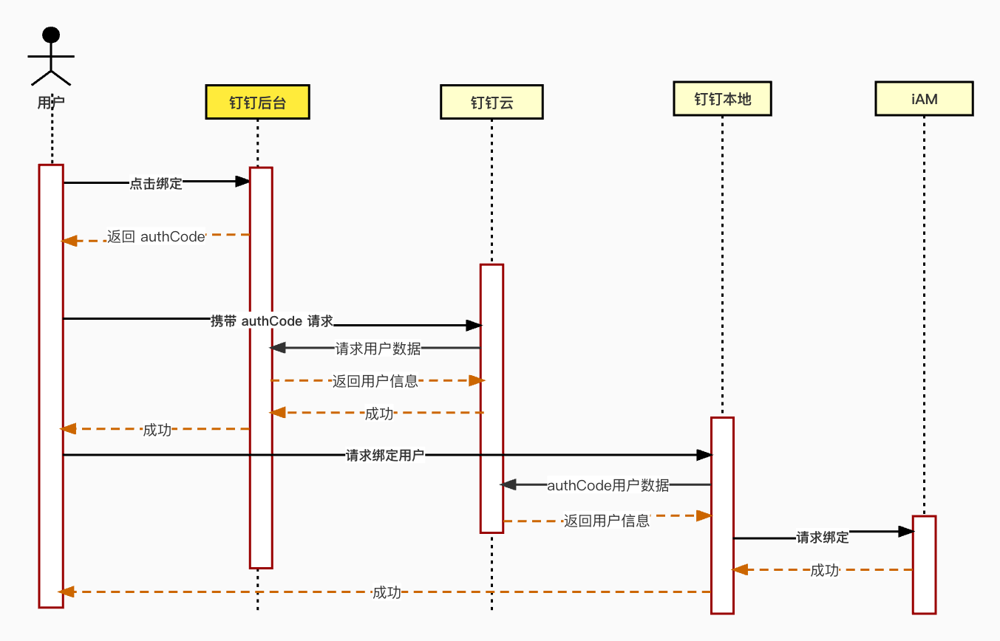

# 钉钉消息发送·用户认证

## 一、主要功能
* 发送消息：调用钉钉发送消息接口，实现第三方平台向企业发送消息。
* 获取人员信息：调用钉钉消息接口，实现第三方平获取企业内用户人信息。

## 二、特殊设计
* 为了让多个环境使用同一个钉钉认证的平台
* 为了解决内网无法被外网主动访问的问题
使用【云端部署】+ 【本地部署】的设计模式。

* 云端部署（DeployMode.CLOUD）

使用 Sqlite 作为存储数据库，要求可以访问外网，可以被外网访问。负责发送向钉钉后端发送请求，请求包括向企业内发送消息，获取企业内人员信息。
* 本地部署（DeployMode.LOCAL）

使用 Postgres 作为数据库，要求可以访问 dingding-be 云端服务，可以被 dingding-be 云端服务访问。钉钉用户的信息存储在本地。

在前端调用后端服务的时候， 前端会调用两个接口，一个接口访问 dingding-be 钉钉云端服务，一个接口请求 dingding-be 钉钉本地服务。
云端服务，接收到请求之后，会向阿里钉钉服务请求，获取结果，将结果存储在本地。
本地服务，接收到请求之后，会向 dingding-be 云端服务请求结果。

项目文件夹中 router 有两个文件， cloud 和 local。
cloud 表示部署在云端时，此文件内的接口会被调用；local 表示部署在边缘端时，此文件内的接口会被调用。

## 三、基本概念

**CorpId**
CorpId是企业在钉钉中的标识，每个企业拥有唯一的CorpId。

**SuiteKey/SuiteSecret**
SuiteKey是第三方企业应用的唯一身份标识，SuiteSecret是对应的调用密钥。

**AgentId**
每个应用都拥有唯一的AgentId。企业在钉钉开发者后台创建应用时，或者在企业授权开通第三方企业应用时，系统会自动生成一个AgentId。

更多内容请参考[官方文档](https://open.dingtalk.com/document/org/basic-concepts)

## 四、基本流程
遵循 OAuth2.0 流程，获取用户身份信息。

